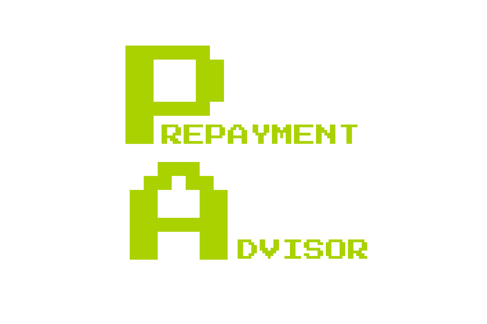

<p align="center">
  
</p>

# Prepayment Advisor

## Table of contents

- [Motivation](#motivation)
- [Installation](#installation)
- [Run](#run)
- [Build](#build)
- [Live App](#live-app)

## Motivation

<p>Our goal is to assist users in tracking their loan EMIs and to encourage prepayments by demonstrating potential savings. By providing insights into how small prepayments or part payments can significantly reduce the overall interest and shorten the loan tenure.</p>
<p>Many people find it challenging to understand the logic behind EMI calculations. Our aim is to simplify this process and help users comprehend how their monthly EMIs are determined. We will provide clear explanations of how each EMI contributes to reducing the principal loan amount and how interest is calculated. By breaking down these details.</p>

[**Read More about Prepayment Advisor**](https://prepayment-advisor.web.app/)

## Installation

```
npm install
```

## Run

```
npm start
```

## Build

```
npm run build
```

## Live App

<a target="_blank" href="https://play.google.com/store/apps/details?id=com.altooxs.prepaymentadvisor">
  
</a>
