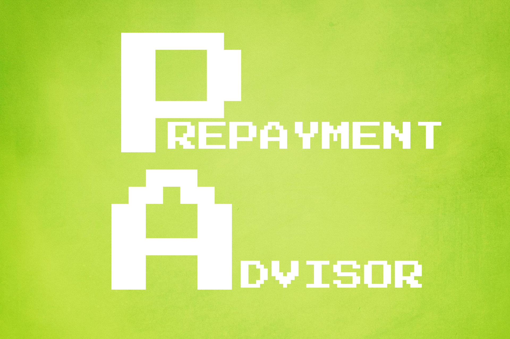

<p align="center">
  
</p>

<h1 align="center">Prepayment Advisor</h1>

<p align="center">
  A personal side project — cross-platform app for loan EMI tracking and prepayment analysis.
</p>

<p align="center">
  <a target="_blank" href="https://play.google.com/store/apps/details?id=com.altooxs.prepaymentadvisor">
    
  </a>
  &nbsp;
  <a target="_blank" href="https://prepayment-advisor.web.app/">
    
  </a>
</p>

---

## About

A hobby project where I wore every hat — product thinking, UX, architecture, and delivery. **Prepayment Advisor** helps users understand EMI breakdowns and the financial impact of loan prepayments, encouraging smarter repayment decisions through clear visualizations and insights.

Many people find it difficult to grasp how EMIs work or how much interest they are actually paying. This app breaks it down — showing exactly how each payment chips away at the principal, and what even a small prepayment can save over the loan tenure.

## Tech Stack

| Layer | Technology |
|---|---|
| Framework | Angular 21 + Ionic 8 |
| Cross-platform | Capacitor 8 |
| Charts | Highcharts |
| Styling | SCSS + Ionic Design System |
| Testing | Karma + Jasmine |
| Hosting | Firebase Hosting |
| Mobile | Android (Google Play) |

## Features

- EMI breakdown with amortization schedule
- Prepayment simulation — see interest and tenure savings
- Loan top-up tracking
- Statistics and visual projections (Highcharts)
- Ledger entries and timeline view
- Backup and restore
- Chit fund calculator

## Getting Started

**Install dependencies**
```bash
npm install
```

**Run in browser**
```bash
npm start
```

**Build for production**
```bash
npm run build
```

**Build for Android**
```bash
npm run android-build
```

## Live App

- Web: [prepayment-advisor.web.app](https://prepayment-advisor.web.app/)
- Android: [Google Play Store](https://play.google.com/store/apps/details?id=com.altooxs.prepaymentadvisor)
